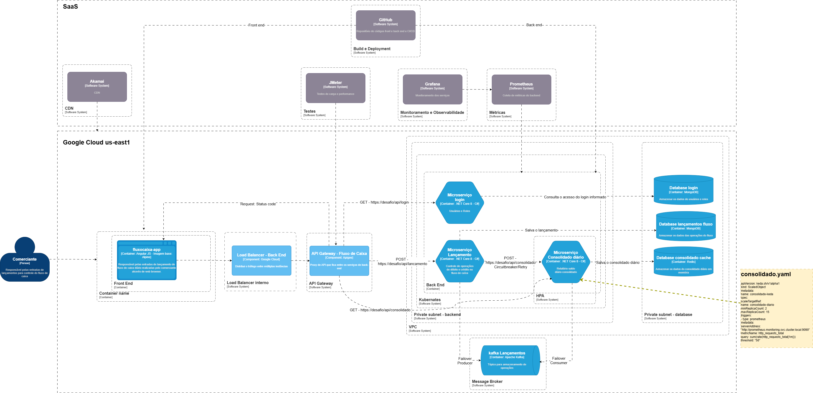
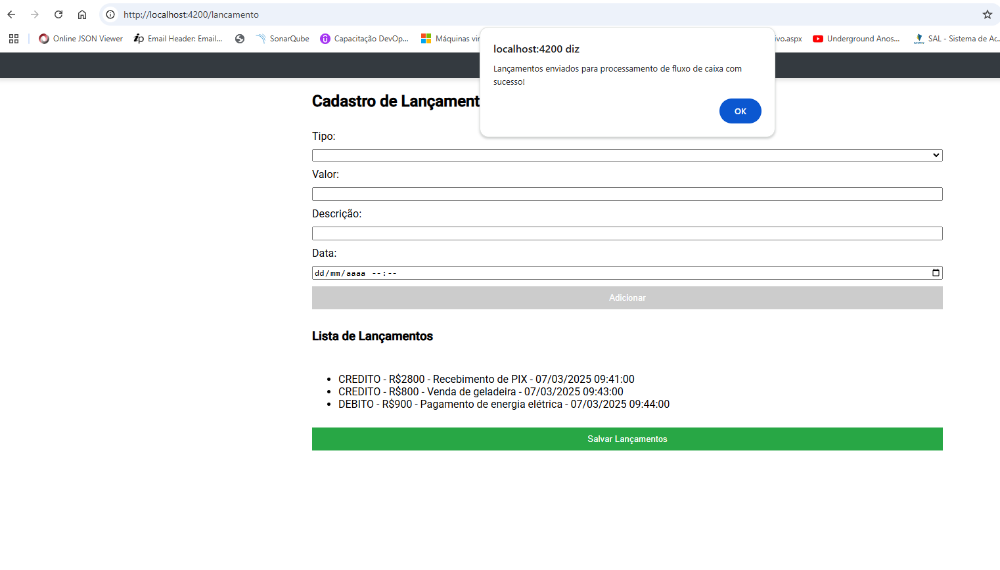
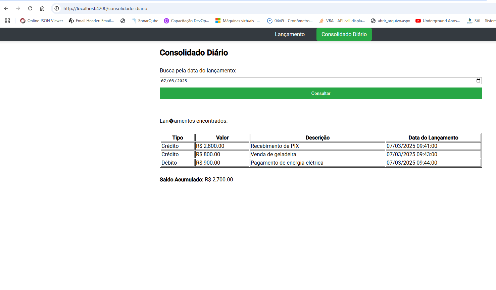
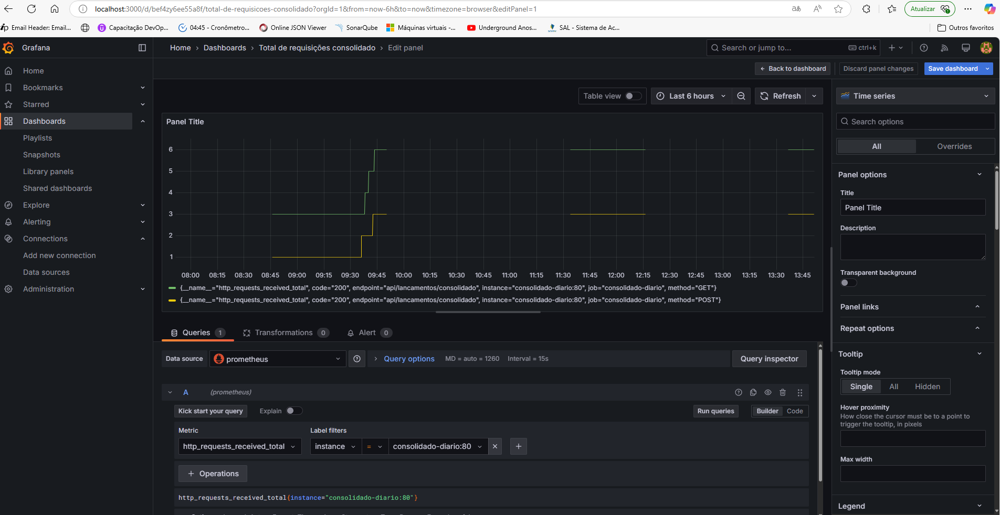
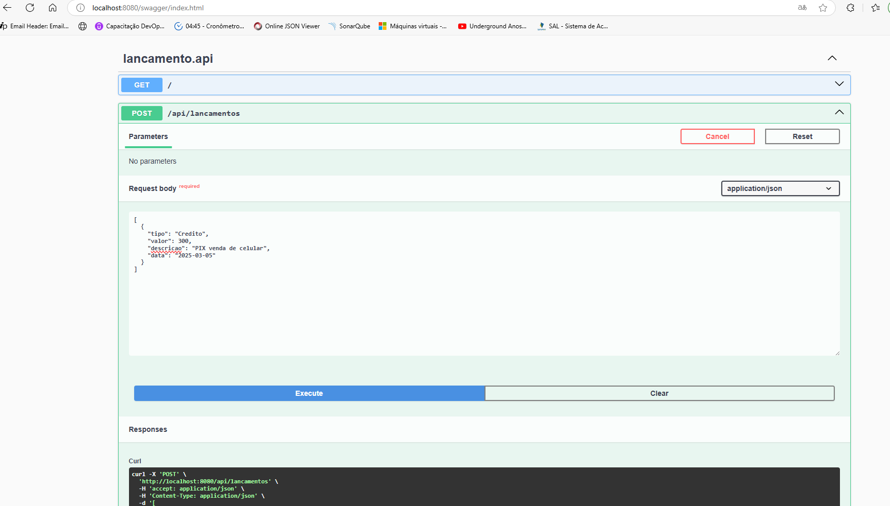
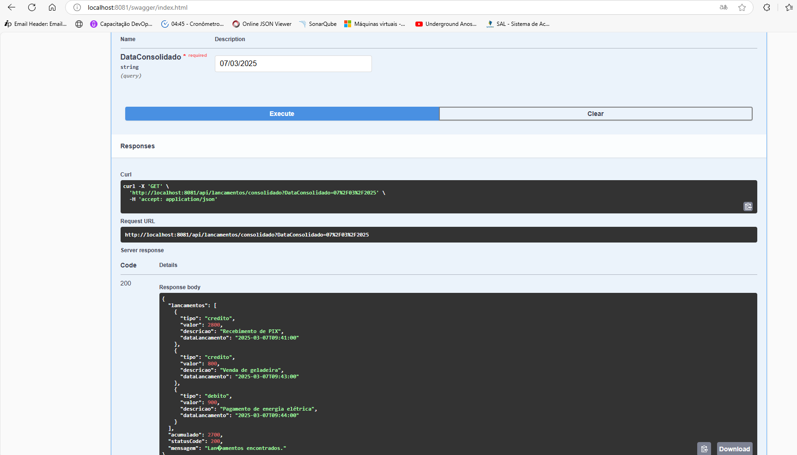
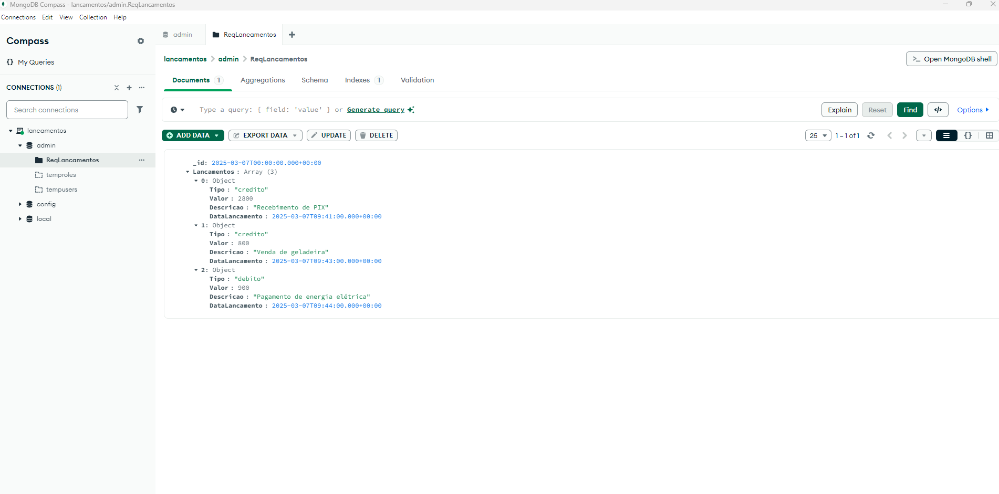
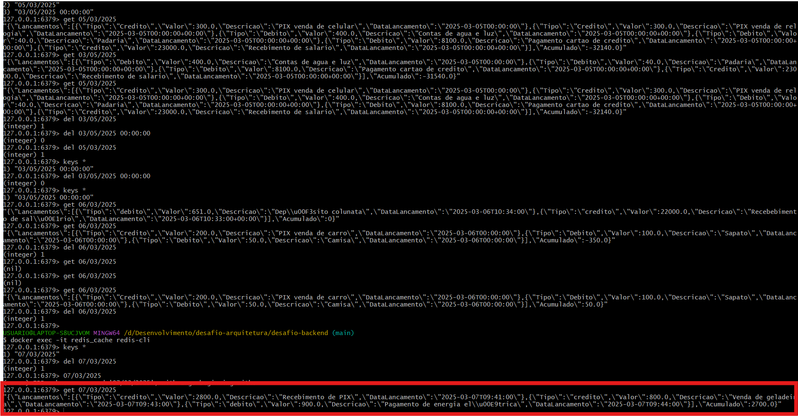
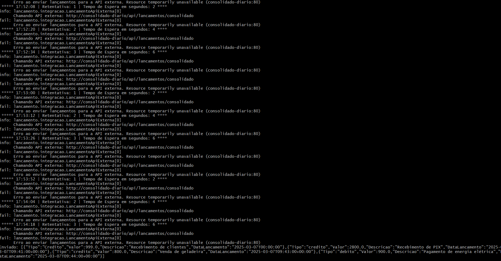
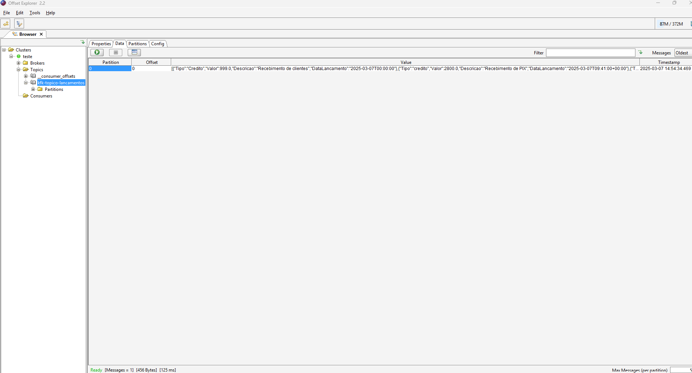

# 🚀 Projeto: Sistema de Lançamentos e Consolidação Diária

Este projeto tem como objetivo fornecer uma plataforma para lançamento e consolidação de dados financeiros. Ele foi desenvolvido utilizando uma arquitetura baseada em microsserviços, garantindo escalabilidade e manutenibilidade. A aplicação é composta por um frontend **Angular 19** e dois microsserviços backend desenvolvidos em **.NET Core 8**, todos integrados por meio do Docker



### **🔴 Pontos de atenção**

Gostaria de ter implementado, porém devido a falta de infraestrutura, budget e tempo para entrega, **não estão contemplados conforme o desenho arquitetural** os componentes/recursos referentes as tecnologias listadas abaixo:
 - Akamai;
 - Subida em cloud;
 - Pipeline CI/CD;
 - Microserviço Login;
 - Autenticação/Autorização;
 - Loadbalancer;
 - API Gateway;
 - Kubernates;
 - VPN.
---

## 📌 Tecnologias Utilizadas

- **Frontend:** Angular 19, TypeScript, RxJS, Angular Forms
- **Backend:** .NET Core 8 (dois microserviços)
- **Banco de Dados:** MongoDB
- **Cache:** Redis
- **Mensageria:** Kafka
- **Monitoramento:** Prometheus e Grafana
- **Containerização:** Docker e Docker Compose

---

## 📝 Justificativa das stacks utilizadas

- **Angular 19, TypeScript, RxJS, Angular Forms:** Permite a reutilização de componentes, melhorando a organização e manutenção do código.
- **.NET Core 8 (dois microserviços):** Estruturado em dois microserviços independentes, arquitetura baseada em microserviços permitindo escalar individualmente. Funciona em Windows, Linux e MacOS cada serviço na qual o código é modular, fácil manutenção e integração com múltiplos serviços.
- **MongoDB:** Suporte a dados dinâmicos, sem necessidade de esquemas rígidos além de gilidade no armazenamento e recuperação de dados sem comprometer o desempenho. O objetivo é gravar os lançamentos indendemente da disponibilidade do microserviço consolidado, pois os dados do mongo servirão como histórico para buscar o que já foi lançado adicionado aos novos lançamentos que vem da tela.
- **Redis:** Pensando na alta disponibilidade de relatório do fluxo de caixa tem baixa latência, escalabilidade resultando na diminuição da carga sobre o banco de dados, melhorando a performance da aplicação
- **Kafka:** Foi escolhido na utilização no contexto de indisponibilidade do serviço de consolidado-diario. Caso ocorra, será realizada comunicação assíncrona entre os microserviços. A execução do serviço consumidor é feita de forma independente da API rodando em background (HostedService).
- **Prometheus e Grafana:** Considero como ferramentas player de mercado para monitorarento de métricas e logs da aplicação além do bom custo benefício.
- **Docker e Docker Compose:**  A aplicação foi containerizada para garantir consistência no ambiente de execução a partir do isolamento do ambiente, ou seja, o código roda da mesma forma em qualquer sistema operacional além da facilidade do deploy e da escalabilidade.

---

## 💡 FinOps dos serviços/tecnologias das aplicações de fluxo de caixa num cenário Google Cloud Platform (GCP)

- ✅ **Google Kubernetes Engine (GKE):** Microserviços;
- ✅ **Cloud Load Balancer:** Distribuição de tráfego entre instâncias;
- ✅ **Cloud SQL - MongoDB:** Armazenamento de dados;
- ✅ **Cloud Memorystore (Redis):** Cache para otimização de performance;
- ✅ **Cloud Pub/Sub (Kafka gerenciado):** Mensageria assíncrona;
- ✅ **Cloud Monitoring & Logging (Prometheus + Grafana):** Monitoramento;
- ✅ **Cloud Build & Artifact Registry:**  CI/CD e armazenamento de imagens Docker.

## 💰 Estimativa de Custos em dólar na Google Cloud Platform (GCP)

| Serviço                         | Especificação                           | Uso Mensal       | Estimativa ($ USD) |
|---------------------------------|----------------------------------------|-----------------|--------------------|
| **Google Kubernetes Engine (GKE)** | 3 nós (4 vCPUs, 16GB RAM cada)         | 730 horas       | $400 - $600        |
| **Cloud Load Balancer**          | Balanceamento global                   | 10 TB tráfego   | $20 - $50          |
| **Cloud SQL** (MongoDB Atlas) | Instância de 2 vCPUs, 8GB RAM         | 730 horas       | $100 - $200        |
| **Cloud Pub/Sub** (Kafka gerenciado) | 5 milhões de mensagens/mês           | Variável        | $50 - $100         |
| **Cloud Memorystore (Redis)**     | 1 instância (4GB)                      | 730 horas       | $50 - $80          |
| **Cloud Monitoring & Logging**    | Coleta e armazenamento                 | 5TB logs/mês    | $30 - $50          |
| **Cloud Storage**                 | 500GB armazenamento                     | Variável        | $20 - $40          |
| **Cloud Build & Artifact Registry** | CI/CD e repositório Docker             | 100 builds/mês  | $10 - $30          |
| **Tráfego de saída (Egress Traffic)** | Para APIs e usuários externos          | 10TB/mês       | $100 - $200        |

## 📌 **Estimativa Total**:
💰 **$800 - $1.350/mês**, dependendo do tráfego e do uso de recursos.

---
#### **Outras possíveis abordagens poderiam contemplar a substituição dos serviços listados acima sendo contratados diretamente com as empresas detentoras das tecnologias. SaaS e PaaS como Alternativas mais econômicas.**
**Exemplos:**
- Usar MongoDB Atlas diretamente ao invés de Cloud SQL;
- Confluent Cloud (Kafka como SaaS) no lugar de Cloud Pub/Sub.
---

## 📁 Estrutura do Projeto

```
├── frontend-angular (Angular 19)
│   ├── src
│   │   ├── app
│   │   │   ├── lancamento
│   │   │   ├── consolidado-diario
│   │   │   ├── services
│   │   │   ├── components
│   │   │   ├── styles.css
│   │   ├── index.html
│   │   ├── main.ts
│   │   ├── ...
│   ├── angular.json
│   ├── package.json
│   ├── Dockerfile
│
├── backend-lancamento (.NET Core 8)
│   ├── MinimalAPI
│   ├── Serviço
│   ├── Repositório
│   ├── Domínio
│   ├── Integração
│   ├── Mensageria
│   ├── appsettings.json
│   ├── Program.cs
│   ├── Dockerfile
│
├── backend-consolidado (.NET Core 8)
│   ├── MinimalAPI
│   ├── Serviço
│   ├── Repositório
│   ├── Domínio
│   ├── Mensageria
│   ├── appsettings.json
│   ├── Program.cs
│   ├── Dockerfile
│
├── docker-compose.yml
├── README.md
```
##### NOTA: Foram consideradas na camada de repositório a utilização de Migrations para o MongoDB, Polly para aplicação de Retry e CircuitBreaker na camada de serviço para resiliência na comunicação entre os microserviços e Kafka para fallover.
---

## 🛠️ Configuração e Execução do Projeto

### **1️⃣ Clonar o Repositório**

```sh
git clone https://github.com/fabiosandrade-via/desafio-arquitetura
cd desafio-arquitetura
```

### **2️⃣ Construir e Subir os Containers**

```sh
docker-compose up --build
```

### **3️⃣ Acessar a Aplicação**

- **Frontend Angular:** [http://localhost:4200](http://localhost:4200)
- **Backend Lançamentos:** http://localhost:8080/swagger/index.html
- **Backend Consolidado diário:** http://localhost:8081/swagger/index.html
- **Grafana:** [http://localhost:3000](http://localhost:3000)
- **Prometheus:** [http://localhost:9090](http://localhost:9090)

---
### **🎨 Evidências de resultados do projeto**
#### Página de lançamentos para o fluxo de caixa

#### Página de consolidado diário

#### Grafana

#### API Lançamentos

#### API Consolidado Diário

#### MongoDB

#### Redis

#### Resiliênca - Retry/CircuitBreaker, usando biblioteca Polly

#### Kafka

---

### **📌 Considerações Finais**
Este projeto foi desenvolvido visando escalabilidade, separação de responsabilidades e facilidade de manutenção, conforme solicitado no documento **desafio-arquiteto-solucao-ago2024.pdf**. Com a arquitetura baseada em microsserviços e containerização, o sistema pode ser facilmente expandido conforme as necessidades do negócio.